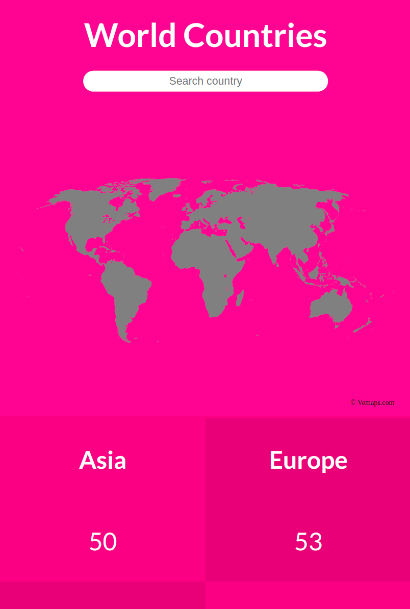
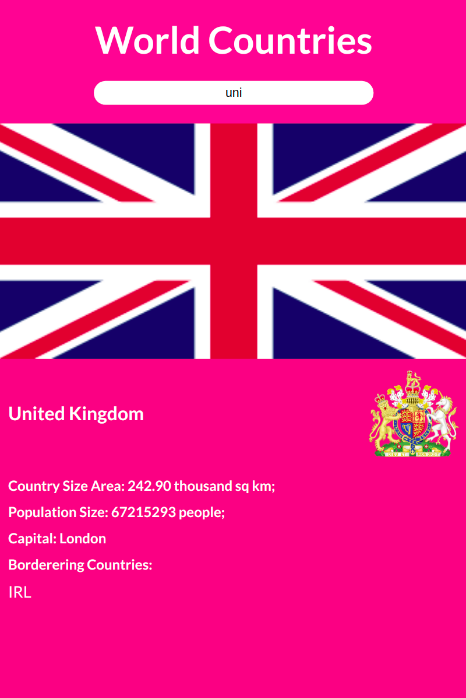

# Space Travellers' Hub

> World Countries App works with an API which returns informations about 195 countries.

Fetching data from [REST COUNTRIES](https://restcountries.com/) API, this app gives informations like area, population, capital, and borders for 195 countries from seven continents.

## Built With

- Major languages: JavaScript, HTML & CSS;
- Frameworks: React;
- Technologies used: Redux, GitHub, GitFlow, Terminal;

## Live Demo

[Live Demo Link](https://world-countries-react-redux.netlify.app/)

## Getting Started

### Prerequisites

- Please make sure you have Node.js packedge installed on your terminal.

### Setup

To get a local copy up and running follow these simple steps.

To setup the bookstore project in your local, in the repo page:
click on code (dropdown list) > Download as ZIP;
or open terminal of path you want to install project and run this command  
`git clone git@github.com:nicupop729/world-countries--react-capstone.git`.

### Install

Run in your terminal the following commands:

**`$ cd world-countries--react-capstone/`** 
**`$ npm install`** 
**`$ npm start`**

## Author

👤 **Nicolae Pop**

- GitHub: [@nicupop729](https://github.com/nicupop729)
- Twitter: [@nicupop729](https://twitter.com/nicupop729)
- LinkedIn: [LinkedIn](https://www.linkedin.com/in/nicolae-pop/)

## 🤝 Contributing

Contributions, issues, and feature requests are welcome!

Feel free to check the [issues page](https://github.com/nicupop729/world-countries--react-capstone/issues).

## Show your support

Give a ⭐️ if you like this project!

## Acknowledgments

This is a project done during React module at **[Microverse](https://www.microverse.org/)**, a remote web-developer school, using their support and frameworks provided. 
For the data, I used [REST COUNTRIES](https://restcountries.com/) API. 
For the design, I used inpiration from [Nelson Sakwa on Behance](https://www.behance.net/sakwadesignstudio) using these [design guidelines](https://www.behance.net/gallery/31579789/Ballhead-App-(Free-PSDs)).

## 📝 License

This project is [MIT](./MIT.md) licensed.
